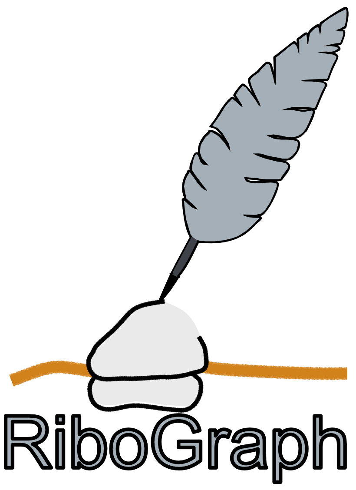

# RiboGraph
 
<a href="https://github.com/ribosomeprofiling/ribograph"></a>
 
RiboGraph is is an interactive web-based tool for browsing ribosome profiling data. As input, it takes [ribo files](https://ribopy.readthedocs.io/en/latest/ribo_file_format.html) that are generated using [Riboflow](https://github.com/ribosomeprofiling/riboflow) and uploaded via the browser. RiboGraph belongs to a [software ecosystem](https://ribosomeprofiling.github.io/) designed to work with ribosome profiling data.
 
Ribograph can deliver at a glance visualizations of QC information, such as read length distributions, region counts, and metagene plots, as well as in depth coverage plots for each gene.
 
 
**RiboGraph** has been tested on Firefox and Safari and usage of these browsers are highly encouraged for RiboGraph.

## Table of contents
  - [Installation](#installation)
  - [Usage](#usage)
    - [Adding a Project](#adding-a-project)
    - [Upload Ribo File](#upload-ribo-file)
    - [QC Plots](#qc-plots)
    - [Coverage Plots](#coverage-plots)
    - [P-Site Correction](#p-site-correction)
    - [Adding References](#adding-references)
    - [More Files](#more-files)
  - [Reference Compatibility](#reference-compatibility)
  - [Development](#development)
    - [Docker Compose Files](#docker-compose-files)
    - [Linting and formatting](#linting-and-formatting)
    - [References](#references)
  - [Implementation Notes](#implementation-notes)
    - [Django HTTPS API](#django-https-api)
 
## Installation
RiboGraph requires [Docker](https://docs.docker.com/install/). Here is a [tutorial for installing it on Ubuntu](https://www.digitalocean.com/community/tutorials/how-to-install-and-use-docker-on-ubuntu-18-04). If you're running into permission issues and being forced to run with sudo, [you might need to add yourself to the docker user group](https://docs.docker.com/engine/install/linux-postinstall/#manage-docker-as-a-non-root-user).
 
RiboGraph runs entirely within a Docker container, and local development should happen within this running container. All other dependencies, including required Python packages and Node.js, are installed inside the container.

First, clone this repository.
```
git clone https://github.com/ribosomeprofiling/ribograph.git --config core.autocrlf=input
```
The config option ensures Unix style line endings. If you opt not to add this option, you may run into problems with building the Docker image on Windows devices.

Go to the Docker folder.

```
cd ribograph/Docker/
```

Make sure that the docker-compose file is in the working folder.
```
ls docker-compose_local.yml
```
 
Build the container. This may take a while.
```
docker compose -f docker-compose_local.yml build
```
 
Once the container is ready, you can run the container.
```
docker compose -f docker-compose_local.yml up
```
Note you might run into issues on Windows when attempting to start the container due to Windows CRLF style line endings. Change the line endings for the .sh and .yml files in the Docker and Docker/web directory from CRLF to LF to fix these.

We recommend using <a href="https://www.mozilla.org/">Firefox</a> for Ribograph. <a href="https://www.mozilla.org/">
</a>

On your browser, go to the URL: [http://localhost:8000/](http://localhost:8000/). 
If the container is built succesfully, you should see a welcome prompt asking you to create a username and password.


 

## Usage

After the docker instance is started, on first time use you will be prompted to create an admin user account. After this, login and you'll be able to add other users through the admin panel, as well as add projects and references.

### Adding a Project

Click on the "+" icon on the bottom right.


Fill out the form. You can leave description box empty.


### Upload Ribo File

Upload your ribo file. If you don't have any, you can download a sample file: [GSM3323389.ribo](https://github.com/ribosomeprofiling/ribograph_sampledata/raw/main/human/GSM3323389.ribo). After you select your file and upload, the system will ask you to select experiments and confirm.


### QC Plots

Click on the experiment name to go to the QC page.


You can use the slider to view a range of ribosome footprints.


### Coverage Plots

For individual transcripts, you can view the ribosome footprint coverage.


You can select transcripts or search them and see their coverage.


### P-Site Correction
Users can select offsets for P-Site Correction for each read length. These offsets can then be used for the coverage plot. Offsets for each experiment are kept in the user's browser local storage.


You can adjust the offset of each footprint length. Then you can save the offsets to use in the coverage.


### Adding References

To be able to view nucelotide sequences in the coverage plot, you need to associate the experiment with a reference.


Reference files must be gzipped fasta files with the "`fa.gz`" extension. If you have the reference file you used for the ribo file, upload it, or if you downloaded and used the sample ribo file `GSM3323389.ribo`, then [download the corresponding refeerence file here](https://github.com/ribosomeprofiling/ribograph_sampledata/raw/main/human/appris_human_v2_selected.fa.gz).

Upload the reference file and give a name to this entry.


Go back to the coverage page and match the experiment with the reference uploaded.


Click on the "Sequence" to view the nucleotide sequences.


### More Files

You can find additional ribo files and references in the following Github repository:
[https://github.com/ribosomeprofiling/ribograph_sampledata](https://github.com/ribosomeprofiling/ribograph_sampledata).

## Reference Compatibility
 
When an experiment is created in the system, an md5 hash sum of the reference of that experiment is also
stored as an attribute of the experiment. This hash sum is obtained by computing the md5 sum of the string S1 + S2, where `+` stands for string concatenation. **S1** is the concatenation of the transcript names in the ribo file in the existing order and
**S2** is the concatenation of the corresponding transcript lengths. The names and lengths are separated by `,` in concatenation.
 
The references of two experiments are called compatible if the hash sum of their references are the same. In practice, this means that
the two experiments are coming from the same transcriptomic reference and therefore their coverages can be viewed together.
 
Reference hash sum is an experiment attribute and it is stored in the `reference_digest` attribute.
 


## Development 

### Docker Compose Files
Ribograph is composed of both a Django backend and a Vue frontend. With the `docker-compose_local.yml` file, the Django development server is started, but not the Vue development server. If you'd like a live reloading development server for the Vue files, use the `docker-compose_local_dev.yml` file.

### Linting and formatting
We use [black](https://black.readthedocs.io/en/stable/) to format Python files and [djlint](https://www.djlint.com/) to format Django templates.
 
To reformat python files:
```
black .
```
 
To lint template files:
```
djlint .
```
 
To reformat template files:
```
djlint . --reformat
```
 


### References
When a ribo file is uploaded, a hash sum is computed for the transcript names and their corresponding lengths. More precisely, the transcript names and their lengths are concatanated and and a single md5 sum of the entire string is computed. This value is used to compare two experiments to conclude whether they have the same transcriptome refrence or not.

When  there is an attempt of matching an experiment with a reference, transcript names and lengths are compared one-by-one and if the first mismatch is reported. This way users can clearly see why their refernce does not match that of the experiment.

## Implementation Notes
RiboGraph is implemented as a Django web app that uses Vue supplementally to provide reactivity on the front-end. During development, both the Django dev server and the hot reloading Vue dev server are run in parallel. During production, the Vue files are built into static assets that are served through Django. This logic is implemented in the [vue_app](ribograph/browser/templates/browser/vue_app.html) Django template.
 
### Django HTTPS API
The Vue app interfaces with the Django backend through [a series of HTTPS APIs](ribograph/browser/api.py). These APIs provide the front-end with the data required to render the charts. Results are cached for around 10 minutes for faster results and a smoother user experience.
 
